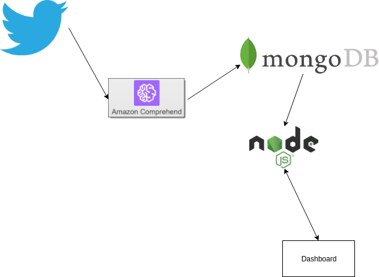

# hackathon-globo
# Projeto
Nossa solução consiste um dashboard que agrega e interpreta dados provenientes da plataforma do gshow e de análise de sentimento de tweets. Por exemplo, é possível saber a tendência da opinião dos telespectadores pela análise dos tweets da novela Sétimo guardião.

# Tecnologias
## Análise de sentimento
 Para a análise de sentimento, foram considerados algoritmos amplamente conhecidos com Python, porém só tinham valia na língua inglesa. Portanto, um dos desafios foi encontrar algoritmos que fossem aplicáveis em português que foi o foco da equipe.
 
 ### Google PLN
 O analisador de linguagem natural da google não funcionou.
 
 ### Algoritmos Supervisionados
 Há algoritmos de machine learning para realizar a análise de sentimento em português. Vide os links posteriores.
 Tentamos alguns algoritmos conhecidos pela academia como o Sentilex com TF IDF (para trending de palavras). Porém devido ao esforço de implementação e foco no mvp, optou pelos serviço AWS Comprehend que realiza a análise de sentimento de texto em diversas línguas.
 
### Arquitetura
O produto final consiste de um script em python que capta os tweets relacionados a novela Sétimo Guardião da globo, enviá-os para a AWS Comprehend que retorna a análise de sentimento. Posteriormente, esses dados sao salvos no MongoDB numa instância AWS. Os dados podem ser visualizados através de um website em ejs servido com Nodejs que recupera os dados do Mongo.

# Tutoriais
* https://python-twitter.readthedocs.io/en/latest/getting_started.html
* http://minerandodados.com.br/index.php/2018/05/15/analise-de-sentimentos-de-uma-forma-diferente/
* https://www.geeksforgeeks.org/twitter-sentiment-analysis-using-python/
* https://cloud.google.com/natural-language/docs/sentiment-tutorial?hl=pt-br
* https://towardsdatascience.com/tfidf-for-piece-of-text-in-python-43feccaa74f8

# Classificação do sentimento de tweets/pt-BR
* https://aws.amazon.com/pt/comprehend/
* https://handyman.dulare.com/sentiment-analysis-with-aws-comprehend-and-python/
* https://www.kaggle.com/leandrodoze/sentiment-analysis-in-portuguese
* https://github.com/pauloemmilio/dataset/blob/master/script.py
* http://inf.ufrgs.br/~kbecker/lib/exe/fetch.php?media=jai2014karinbeckerversaofinal.pdf

# Importância das palavras
* https://stevenloria.com/tf-idf/

# TFIDF
* https://nlpforhackers.io/tf-idf/
